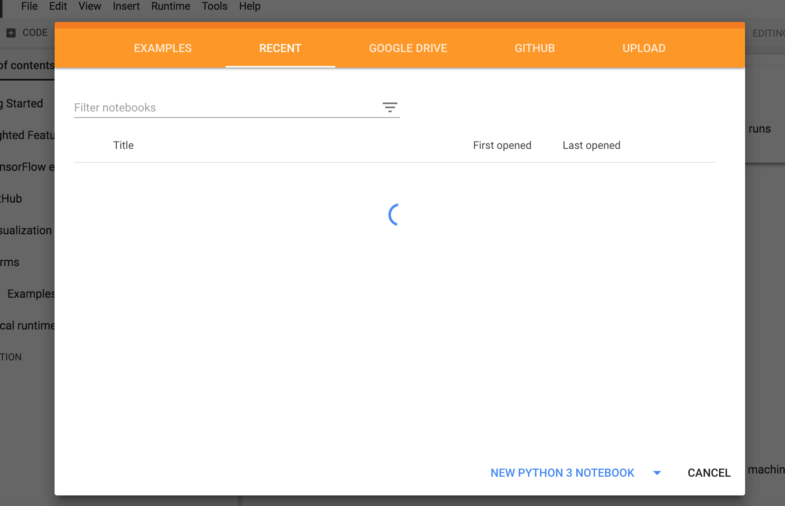
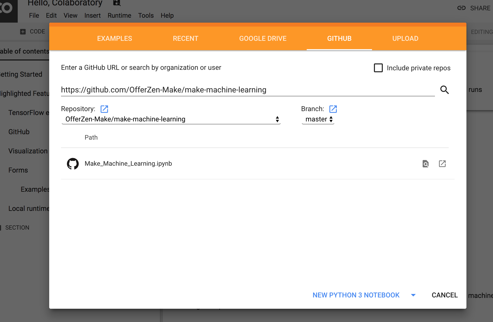
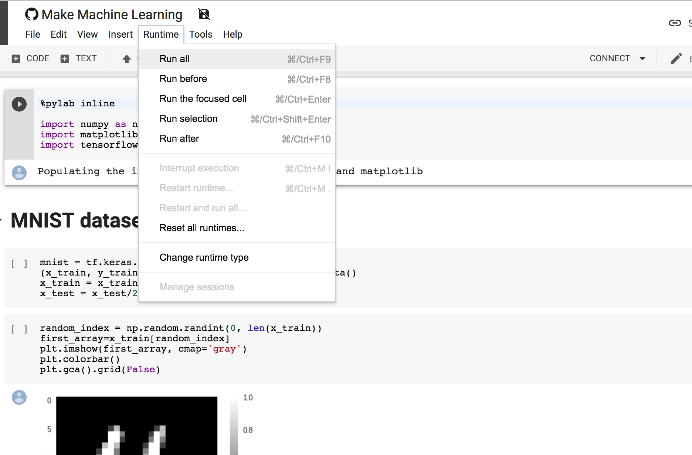

# Machine Learning with Scikit-Learn and TensorFlow

# Hello

We're excited to have you join this course, where you'll be building machine learning models for image classification using Scikit-learn and Tensorflow.

The aim of Make Days is to explore and learn new thing. You don't need to achieve specific goals. The structure caters for varying levels of experience and different Makers will learn different things by playing with the same tools.

# Preparing for the Make Day
Makers that arrive well prepared get the most out of their experience. Before you attend your Make Day, there are a couple of activities to complete.

## Getting started

- [ ] Join Make Slack, introduce yourself in #introductions, and check in with your team channel
- [ ]  Learn about the how, where and why of Make Days
- [ ]   Complete prep activities and check out the further reading and info

## Prep activities

Time at a Make Day is valuable! Arrive well prepared to get the most out of it.

- [ ] [Set up Colaboratory](#set-up-colaboratory)
- [ ] Read [Machine Learning in 5 minutes](https://medium.com/@vashkelis/machine-learning-in-5-minutes-9a6cce23ce7e)

## Set up colaboratory

[Colaboratory](https://colab.research.google.com) from Google is a Jupyter notebook environment that requires no setup and runs entirely in the cloud making it ideal for tutorials and workshops as no installation is necessary to get started.

We'll use Colaboratory exclusively through the Make Day. 

To get started with Colaboratory you will first need a Google account. If you don't have a Google account (Gmail for example), then you will need to create one prior to arriving at the Make Day [here](https://accounts.google.com/SignUp?hl=en).

With your Google account you should be able to login to [Colaboratory](https://colab.research.google.com).

You'll see a screen like this:

We recommend that you go through the information in the Examples section before coming to the Make Day.

In the Github section enter the Make Machine Learning URL `https://github.com/OfferZen-Make/make-machine-learning` and select the Github repo to clone it

You should now see a Jupyter Notebook. Select `Runtime -> Run All` in the notebook menu bar and make sure that everything runs as it should. If so, great! If not, please send an email `helge@offerzen.com`.

That's all, you're ready for Make Day!

## Useful resources
- [OfferZen Make Subreddit](https://www.reddit.com/r/offerzenmake): check it out and upvote any answers you find useful. Feel free to add your own questions and comments!
- [Tensorflow documentation](https://www.tensorflow.org/api_docs/)
- [Scikit-learn documentation](http://scikit-learn.org/stable/documentation.html)
- [Fast AI courses and code](https://www.fast.ai/)

*Know somebody who would enjoy this course? Tell your friends to [register here.](https://docs.google.com/forms/d/e/1FAIpQLSd9T-N8K519J89ohbLSZ17OebjLrwRhy9hXnSDRcPXEDM0dEQ/viewform?usp=sf_link)

